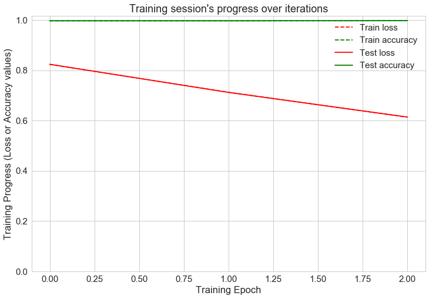

# Cloud Services PMU classifier

This is created to apply dmachine learning (ML) algorithms on PMU.
This will implement ML algorithms as micro service structure on cloud platform.
Models are created in Tensorflow and keras framework. 

The PMU have following data points:
 <ul style="list-style-type:disc">
  <li>Frequency</li>

   
 
_**Fig. 1:** Data points_
  <li>V RMS</li>

    
  
_**Fig. 2:** Data points_
  <li>V phase angle</li>

    
  
_**Fig. 3:** Data points_
  <li>I RMS</li>

   
 
_**Fig. 4:** Data points_
  <li>I phase angle</li>

 </ul>
 
 
# Results

Confusion matrix

  
_**Fig. 5:** Confusion matrix_
 
Accuracy
  
_**Fig. 6:** Accuracy_
